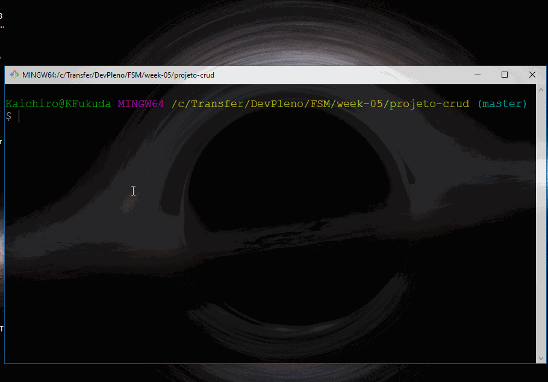

## NodeJS com MySQL

---

Projeto para estudos sobre utilização do NodeJS com MySQL (persistência apenas com comandos SQL)




* Clone este projeto

```sh
$ git clone https://github.com/kaichiro/node-mysql-only-sql.git
```

---

##### Configurando o projeto

* Variáveis do projeto

  * O arquivo ```.env-example``` é um exemplo de configuração de variáveis de ambiente;
  * Duplique este arquivo ```.env-example```;
  * Renomeie o novo arquivo para ```.env```;

* Modifique as informações deste novo arquivo para as credenciais do banco em questão.

```sh
DB_HOST=endeco_de_host
DB_PORT=numero_de_portas
DB_USER=nome_usuario_banco
DB_PASSWORD=senha_usuario_banco
DB_DATABASE=nome_alias_banco
```

---

##### Executando o projeto

- No diretório principal do projeto, execute o comando abaixo para instalar as dependências do projeto

```sh
$ yarn
```

- Executar o projeto

```sh
$ yarn start
```

---

[DevPleno - Fullstack Master](https://www.devpleno.com/)